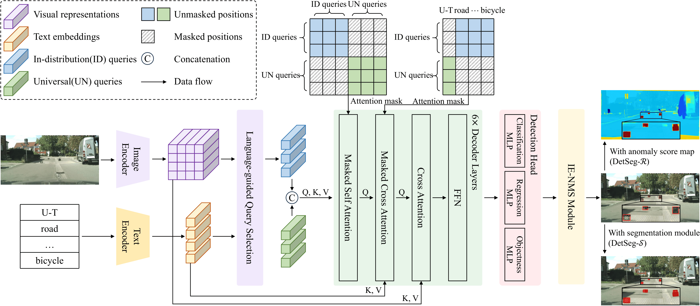

# Beyond Pixel Uncertainty: Bounding the OoD Objects in Road Scenes

<p align="center">
  
</p>


This is the official implementation of **"DetSeg: A Novel Paradigm for Road Anomaly Detection with Object-Level Understanding"** (ICCV 2025).

## 📋 Abstract

Recognizing out-of-distribution (OoD) objects on roads is crucial for safe driving. Most existing methods rely on segmentation models' uncertainty as anomaly scores, often resulting in false positives - especially at ambiguous regions like boundaries, where segmentation models inherently exhibit high uncertainty. Additionally, it is challenging to define a suitable threshold to generate anomaly masks, especially with the inconsistencies in predictions across consecutive frames.

We propose **DetSeg**, a novel paradigm that helps incorporate object-level understanding. DetSeg first detects all objects in the open world and then suppresses in-distribution (ID) bounding boxes, leaving only OoD proposals. These proposals can either help previous methods eliminate false positives (**DetSeg-𝓡**), or generate binary anomaly masks without complex threshold search when combined with a box-prompted segmentation module (**DetSeg-𝓢**).

Additionally, we introduce **vanishing point guided Hungarian matching (VPHM)** to smooth the prediction results within a video clip, mitigating abrupt variations of predictions between consecutive frames.

## ✨ Highlights

- 🚀 **Object-Level Understanding**: Leverages detection to suppress false positives at ambiguous regions
- 🎯 **Two Variants**: DetSeg-𝓡 (refine existing methods) & DetSeg-𝓢 (threshold-free segmentation)
- 📉 **Up to 37.45% FPR₉₅ reduction** compared to previous methods

## 🛠️ Installation

### Requirements
- Python >= 3.8
- PyTorch 2.3.0
- CUDA 11.8+

### Step-by-step Installation

```bash
# Clone the repository
git clone https://github.com/your-username/DetSeg.git
cd DetSeg

# Create conda environment
conda create -n detseg python=3.8 -y
conda activate detseg

# Install PyTorch
pip install torch==2.3.0 torchvision==0.18.0 --index-url https://download.pytorch.org/whl/cu118

# Install mmcv and mmengine
pip install -U openmim
mim install mmengine
mim install "mmcv>=2.0.0"
mim install "mmcv>=2.0.0rc4,<2.2.0"

# Install DetSeg
pip install -v -e .

# Install other dependencies
pip install "mmsegmentation>=1.0.0"
pip install ftfy
pip install ood_metrics
pip install numpy==1.23.0
pip install nltk==3.8.1
python -m pip install ujson
```

## 📁 Data Preparation

```
data/
├── cityscapes/
│   ├── leftImg8bit/
│   │   ├── train/
│   │   ├── val/
│   │   └── test/
│   └── gtFine/
├── fishyscapes/
│   ├── LostAndFound/
│   └── Static/
├── road_anomaly/
└── segment_me_if_you_can/
    ├── dataset_AnomalyTrack/
    └── dataset_ObstacleTrack/
```

## 🚀 Training

### Detection Module

```bash
# Single GPU
python tools/train.py configs/detseg/grounding_dino_swin-b_finetune_obj365.py

# Multi-GPU (8 GPUs)
./tools/dist_train.sh configs/detseg/grounding_dino_swin-b_finetune_obj365.py 8
```

### Segmentation Module

```bash
# Single GPU
python tools/train.py configs/detseg/grounding_dino_swin-b_seg_cityscapes.py

# Multi-GPU (8 GPUs)
./tools/dist_train.sh configs/detseg/grounding_dino_swin-b_seg_cityscapes.py 8
```

## 📊 Evaluation

### Test on Fishyscapes

```bash
# Single GPU
python tools/test.py configs/detseg/grounding_dino_swin-b_sam_seg_test.py ckpt_path

# Multi-GPU (8 GPUs)
./tools/dist_test.sh configs/detseg/grounding_dino_swin-b_sam_seg_test.py ckpt_path 8
```

### Test on Road Anomaly

```bash
python tools/test.py configs/detseg/grounding_dino_swin-b_sam_seg_road_anomaly.py ckpt_path
```

### Test on SMIYC

```bash
python tools/test.py configs/detseg/grounding_dino_swin-b_sam_seg_smiyc.py ckpt_path
```

## 🎨 Visualization

```bash
python demo/image_demo.py \
    {image_path} \
    configs/detseg/grounding_dino_swin-b_sam_seg_test.py \
    --pred-score-thr 0.2 \
    --weights {ckpt_path} \
    --texts 'road. sidewalk. building. wall. fence. pole. traffic light. traffic sign. vegetation. terrain. sky. person. rider. car. truck. bus. train. motorcycle. bicycle'
```


## 📝 Citation

If you find this work helpful, please consider citing:

```bibtex
@InProceedings{Zhu_2025_ICCV,
    author    = {Zhu, Huachao and Liu, Zelong and Sun, Zhichao and Zou, Yuda and Xia, Gui-Song and Xu, Yongchao},
    title     = {Beyond Pixel Uncertainty: Bounding the OoD Objects in Road Scenes},
    booktitle = {Proceedings of the IEEE/CVF International Conference on Computer Vision (ICCV)},
    month     = {October},
    year      = {2025},
    pages     = {8472-8481}
}
```

## 🙏 Acknowledgements

This project is built upon [MMDetection](https://github.com/open-mmlab/mmdetection), [Grounding DINO](https://github.com/IDEA-Research/GroundingDINO), and [SAM](https://github.com/facebookresearch/segment-anything). We thank the authors for their excellent work.

## 📄 License

This project is released under the [Apache 2.0 license](LICENSE).